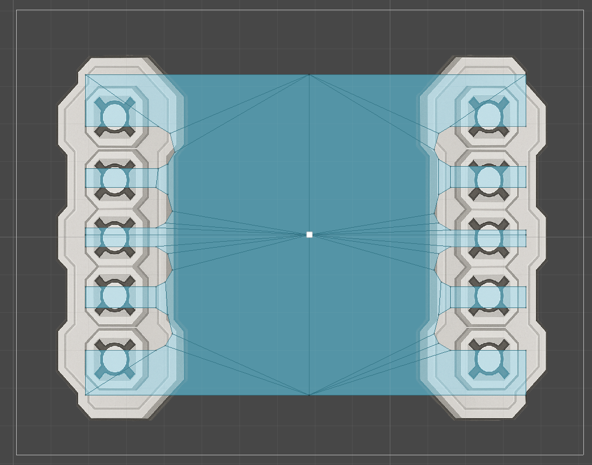

# Drone Resource Simulation
Unity version: 2022.3.6f1 (LTS)

**Симуляция:**  
Дроны двух фракций (красной и синей) автоматически собирают ресурсы в открытом космосе и возвращают их на базу. Пользователь может настраивать параметры симуляции через UI, включая скорость дронов и частоту появления ресурсов.

---

## Реализовано

### Через UI:
- Отображение текущего состояния выбранного дрона (используется `enum`):  
  `Idle`, `MovingToResource`, `Gathering`, `Returning`
- Настройка количества дронов
- Управление скоростью симуляции
- Подсчёт и отображение собранных ресурсов по фракциям
- Настройка скорости дронов (`agent.speed`)
- Пользователь задаёт желаемое количество ресурсов в интервале 10 секунд интервал генерации = `10 / количество`
  


- Зум на дрона по двойному клику  
- Сброс камеры по двойному клику на пустую область
- При выборе дрона его текущее состояние отображается под счетчиком очков
  


- Дроны используют `NavMeshAgent` и ограниченную запечённую зону полёта со стенками
- При создании дронов им автоматически назначается случайный приоритет обхода, что помогает избежать «толкучки» при движении к цели.
- У каждой фракции своя база с ячейками для дронов
- Ресурсы имеют булевую переменную для предотвращения коллизий при захвате
- Каждый дрон при создании получает уникальное значение `avoidancePriority`:
  ```csharp
  agent.avoidancePriority = Random.Range(0, 100);
  ```
  
  

---
## Particle System (Турбины)

- **Поддержка нескольких турбин**  
  Скрипт использует массив `ParticleSystem[]`, что позволяет управлять сразу несколькими шлейфами (например, для дронов с двумя или четырьмя двигателями).

- **Адаптация к скорости**  
  Значение `startLifetime` у каждой системы частиц изменяется пропорционально текущей скорости дрона (полет/остановка с использованием `agent.velocity.magnitude`)

- **Порог отключения шлейфа**  
  Если скорость дрона опускается ниже значения `minSpeedThreshold`, длина шлейфа (`startLifetime`) интерполируется к `0`, визуально отключая двигатель.
  


```csharp
        foreach (var trail in engineTrails)
        {
            var main = trail.main;
            float currentLifetime = main.startLifetime.constant;
            float newLifetime = Mathf.Lerp(currentLifetime, targetLifetime, Time.deltaTime * fadeSpeed);
            main.startLifetime = new ParticleSystem.MinMaxCurve(newLifetime);
        }
```

## Компоненты / Скрипты

### `DroneController`
Управляет логикой поведения дрона:
- Состояния: `Idle`, `MovingToResource`, `Gathering`, `Returning`
- Самостоятельно ищет ближайший ресурс, перемещается к нему, собирает и возвращает на базу
- Использует `NavMeshAgent` для перемещения и поворота
  


### `DroneSpawner`
- Спавнит дронов в заданных слотах `homeSlot`

- Позволяет менять количество активных дронов и их параметры (фракция, скорость)
- Удаляет лишних дронов при уменьшении количества

### `ResourceManager`
- Распределяет ресурсы по карте, контролирует частоту появления
- Предоставляет дронам доступ к ближайшему незанятому ресурсу
- Отслеживает и отображает счёт собранных ресурсов по фракциям
